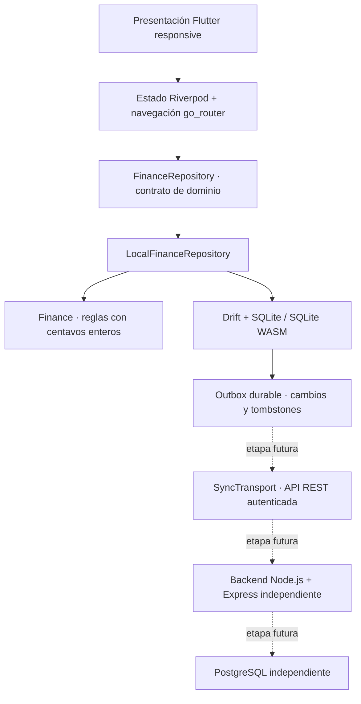

# Nido Finanzas · Arquitectura del MVP

## Capas y responsabilidades

- `lib/presentation`: páginas, formularios, componentes, tema y gráficos.
- `lib/core`: providers de estado, mes seleccionado y preferencias persistentes.
- `lib/domain`: modelos, interfaz de repositorio y reglas financieras sin dependencia de Flutter.
- `lib/data`: esquema SQL declarativo, código Drift generado, repositorio y datos de demostración.
- `lib/services`: configuración pública de la futura API, sin secretos.
- `lib/sync`: contrato de transporte, revisiones y cursor. No realiza llamadas de red.
- `backend`: servicio Express independiente, pool PostgreSQL preparado y migración inicial de referencia.

La presentación consume modelos de dominio. El repositorio puede reemplazarse en tests o en una etapa futura sin incorporar credenciales ni reglas del servidor a la UI.

## Modelo de datos

Tablas SQLite: `users`, `households`, `household_members`, `accounts`, `categories`, `movements`, `budgets`, `recurring`, `installments`, `debts`, `goals`, `outbox`, `sync_state`.

Los usuarios son globales; los registros financieros tienen `household_id`. Las claves foráneas compuestas de cuentas, categorías y gastos recurrentes impiden referencias entre hogares. El repositorio vuelve a validar pertenencia y existencia de registros activos. La aplicación del MVP abre un único hogar local; el selector multiusuario todavía no está implementado.

Cada entidad contiene `updated_at`, `deleted_at` y `revision`. Los IDs de registros creados por la app son UUID. Los IDs legibles de demostración son exclusivamente locales y no deben migrarse a PostgreSQL. SQLite posee restricciones para cantidades, tipos, transferencias y presupuestos activos únicos por categoría y mes. `PRAGMA foreign_keys` está activado. El esquema es versión 1, generado por Drift; una futura modificación requiere una migración y pruebas de datos existentes.

## Semántica financiera

- Importes positivos en centavos enteros. El signo se determina por ingreso, gasto o transferencia; se conserva el signo del saldo inicial.
- El saldo es saldo inicial + ingresos − gastos + transferencias recibidas − transferencias enviadas. El saldo actual excluye movimientos fechados en el futuro.
- El saldo consolidado incluye tarjetas con signo negativo y cuentas de ahorros. Las transferencias no cambian el consolidado ni son ingresos/gastos.
- Los reportes mensuales incluyen movimientos según su fecha registrada, incluso si son futuros. La evolución del saldo refleja el cierre de cada mes y no es una valoración completa del patrimonio: no incorpora automáticamente deudas externas ni cuotas no registradas.
- Un presupuesto de una categoría incluye sus descendientes. Los presupuestos de categoría principal y subcategoría son límites independientes; no deben sumarse como si fueran gastos distintos.
- Una compra en cuotas planifica un importe; no registra el total como gasto. Cada cuota se registra manualmente una sola vez en la secuencia de pagos y por su importe exacto. El resto de centavos se distribuye entre las primeras cuotas. El vencimiento se calcula desde la fecha original, evitando perder el día 31 después de febrero.
- Los gastos recurrentes requieren un clic en «Registrar pago». El gasto se fecha el día del registro y el próximo vencimiento avanza según la frecuencia. La recurrencia mensual ajusta el día al final de un mes corto.
- Las deudas reflejan compromisos y sus pagos/cobros se registran como flujos de caja. Registrar una deuda no crea automáticamente el movimiento de recepción o entrega inicial del préstamo.
- Los aportes a metas generan transferencias a una cuenta de ahorros y aumentan el acumulado de la meta. El acumulado refleja aportes asignados, no un bloqueo de fondos. Los retiros, reasignación entre metas y conciliación del acumulado con el saldo disponible quedan para una siguiente etapa.
- Los movimientos generados por pagos/aportes permiten editar notas; su importe y eliminación se protegen para evitar desajustar los acumulados. La anulación transaccional de esos pagos es trabajo pendiente.

Guardar una entidad y su evento outbox sucede en la misma transacción. Registrar un pago/aporte y modificar su plan también sucede en una transacción. Las eliminaciones son lógicas; las referencias activas bloquean borrar cuentas y categorías en uso. El balance se deriva del historial, no se modifica en dos lugares separados.

## Persistencia y offline

En Android, iOS y escritorio, Drift abre un archivo SQLite local. En web, usa SQLite WASM y un worker oficial de la misma versión. Los assets se guardan en el repositorio y los recursos Flutter/CanvasKit se incluyen localmente en el build. El service worker propio guarda el shell completo de la aplicación; la primera visita requiere conexión y completar la instalación de la caché. El usuario conserva datos al cerrar y abrir el navegador mientras no borre el almacenamiento del sitio.

GitHub Pages no permite personalizar todos los encabezados para almacenamiento web avanzado. Drift selecciona la implementación compatible; en Chrome Android sin COOP/COEP el uso simultáneo de varias pestañas tiene limitaciones. Probar los navegadores objetivo y definir la estrategia de almacenamiento/hosting antes del lanzamiento comercial. Fuente: [documentación web de Drift](https://drift.simonbinder.eu/platforms/web/).

## Sincronización futura

El outbox actual captura cambios de usuario, no los registros demo iniciales. El diseño de sincronización debe:

1. Autenticar sesiones y autorizar membresía del hogar en el servidor.
2. Crear hogares cloud con UUID y migrar registros locales seleccionados; evitar subir automáticamente datos demo.
3. Enviar lotes con IDs de operación idempotentes, entidad, revisión base, operación y payload completo. Transmitir montos como strings decimales seguros para BIGINT.
4. Aceptar eventos únicamente después de confirmar el commit PostgreSQL, y recién entonces retirar esos eventos del outbox local.
5. Rechazar conflictos de revisión explícitamente; no elegir silenciosamente un saldo ganador.
6. Descargar cambios con cursor de servidor y aplicar entidades y tombstones en una transacción SQLite. No volver a emitir al outbox lo recibido.
7. Reintentar con backoff, soportar trabajo offline prolongado y probar transferencias, cuotas y aportes concurrentes entre usuarios.

No hay implementación activa de push/pull, autenticación ni resolución de conflictos. El endpoint de sincronización devuelve 501 para impedir usar un servicio incompleto como API financiera.
